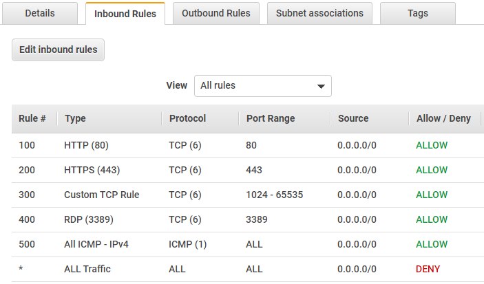
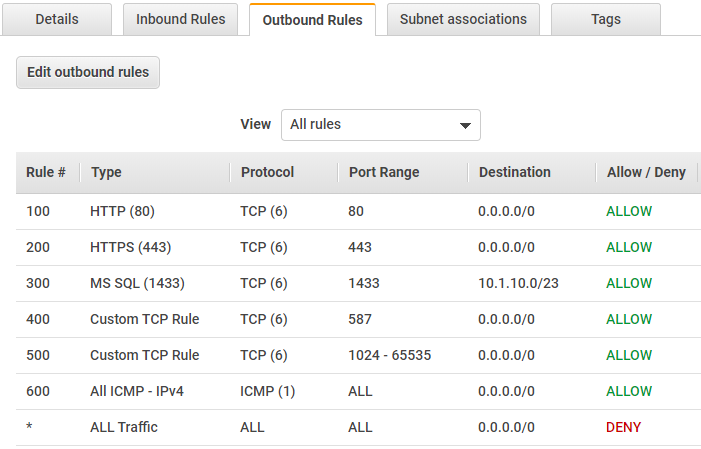

# Network ACL Rule Template
Network ACL's can be quite time consuming to code, and reviewing defined rules often requires scrolling through potentially long Cloudformation templates.

This YAML Cloudformation template can be nested into a parent stack and is designed to simplify the creation and readibility of up to 20 of your Inbound\Outbound NACL rules.

## Using the template:
The template uses the following parameters:

* `NetworkACLId` The Id of the Network ACL that you wish to attach the set of rules to.
* `RuleDef01 - RuleDef20` The rules that you wish to define in the format 'In\Out,RuleNo,ProtocolNo,FromPort,ToPort,Cidr,allow\deny'.

## RuleDef Format
* `In/Out` The direction of the rule. Inbound or Outbound.
* `RuleNo` The unique rule number within the inbound or outbound rule sets.
* `ProtocolNo` The protocol number for the rule. Eg, -1 ALL, 1 ICMP, 6 TCP or 17 UDP. [Full list here](https://www.iana.org/assignments/protocol-numbers/protocol-numbers.xhtml)
* `FromPort` The start of the listening port range for the traffic. For example, 80 for HTTP traffic.
* `ToPort` The end of the listening port range for the traffic. For example, 80 for HTTP traffic.
* `Cidr` The source or destination for the rule traffic (CIDR range).
* `allow\deny` Whether to allow or deny the specified traffic.

## Sample CloudFormation snippet:

The following YAML snippet demonstrates how to use the stack within your parent template:

```yaml
Resources:
  NACLRules:
    Type: AWS::CloudFormation::Stack
    Properties: 
      Parameters: 
        NetworkACLId: !Ref TargetNetworkACL
        #RuleDefx: !Join [ ",", [ In\Out,RuleNo,ProtocolNo,FromPort,ToPort,Cidr,allow\deny ] ]
        RuleDef01: !Join [ ",", [ In,100,6,80,80,0.0.0.0/0,allow ] ]
        RuleDef02: !Join [ ",", [ In,200,6,443,443,0.0.0.0/0,allow ] ]
        RuleDef03: !Join [ ",", [ In,300,6,1024,65535,0.0.0.0/0,allow ] ]
        RuleDef04: !Join [ ",", [ In,400,6,3389,3389,0.0.0.0/0,allow ] ]
        RuleDef05: !Join [ ",", [ In,500,1,-1,-1,0.0.0.0/0,allow ] ]

        RuleDef06: !Join [ ",", [ Out,100,6,80,80,0.0.0.0/0,allow ] ]
        RuleDef07: !Join [ ",", [ Out,200,6,443,443,0.0.0.0/0,allow ] ]
        RuleDef08: !Join [ ",", [ Out,300,6,1433,1433,10.1.10.0/23,allow ] ]
        RuleDef09: !Join [ ",", [ Out,400,6,587,587,0.0.0.0/0,allow ] ]
        RuleDef10: !Join [ ",", [ Out,500,6,1024,65535,0.0.0.0/0,allow ] ]
        RuleDef11: !Join [ ",", [ Out,600,1,-1,-1,0.0.0.0/0,allow ] ]

      TemplateURL: "https://{S3-Bucket-URL}/{S3-Key-Path}/naclrules.yml"
      TimeoutInMinutes: 30
```

> 
> 